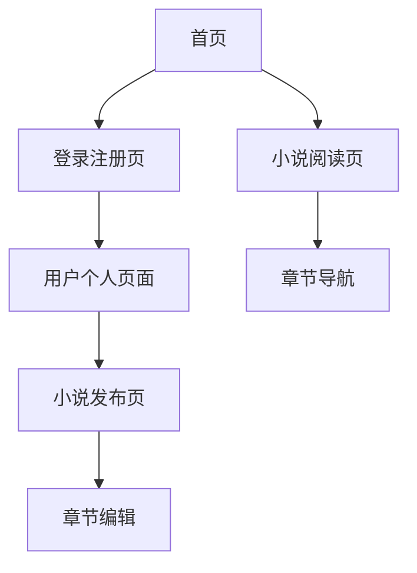

# 玉扶疏小说网站产品需求文档

## 1. 产品概述
玉扶疏是一个专注于原创小说创作与阅读的在线平台，为用户提供便捷的小说发布、阅读和管理功能。
- 解决问题：为小说爱好者提供一个简洁优雅的创作和阅读平台，支持实时更新和文件管理
- 目标用户：小说作者、小说读者、文学爱好者
- 产品价值：打造一个高效的小说创作生态，提升用户的创作和阅读体验

## 2. 核心功能

### 2.1 用户角色
| 角色 | 注册方式 | 核心权限 |
|------|----------|----------|
| 游客用户 | 无需注册 | 可浏览首页和公开小说列表 |
| 注册用户 | 邮箱注册 | 可阅读小说、发布小说、管理个人作品 |

### 2.2 功能模块
我们的小说网站包含以下主要页面：
1. **首页**：网站导航、推荐小说、最新更新列表
2. **小说阅读页**：章节内容展示、章节导航、阅读设置
3. **用户个人页面**：个人信息、我的作品、作品管理
4. **登录注册页**：用户认证、账户创建
5. **小说发布页**：创建新小说、章节编辑、封面上传

### 2.3 页面详情
| 页面名称 | 模块名称 | 功能描述 |
|----------|----------|----------|
| 首页 | 导航栏 | 网站logo、主要页面链接、用户登录状态显示 |
| 首页 | 推荐区域 | 展示精选小说，包含封面、标题、简介 |
| 首页 | 最新更新 | 显示最近更新的小说章节列表 |
| 小说阅读页 | 章节内容 | 显示当前章节文本内容，支持字体大小调节 |
| 小说阅读页 | 章节导航 | 上一章、下一章、章节目录导航 |
| 小说阅读页 | 阅读设置 | 字体大小、背景色、行间距调节 |
| 用户个人页面 | 个人信息 | 用户头像、昵称、注册时间显示 |
| 用户个人页面 | 我的作品 | 已发布小说列表，包含编辑、删除功能 |
| 用户个人页面 | 作品统计 | 作品数量、总字数、阅读量统计 |
| 登录注册页 | 登录表单 | 用户名/邮箱、密码输入，登录验证 |
| 登录注册页 | 注册表单 | 用户名、邮箱、密码注册，邮箱验证 |
| 小说发布页 | 基本信息 | 小说标题、简介、分类设置 |
| 小说发布页 | 封面上传 | 支持图片上传，自动保存为cover.png |
| 小说发布页 | 章节编辑 | 富文本编辑器，章节标题和内容编辑 |

## 3. 核心流程

**游客用户流程：**
用户访问首页 → 浏览推荐小说 → 点击小说进入阅读页 → 阅读章节内容

**注册用户流程：**
用户登录 → 访问个人页面 → 点击发布小说 → 填写小说信息 → 上传封面 → 编辑章节 → 发布作品 → 系统实时检测文件变化并更新展示

## 4. 用户界面设计

### 4.1 设计风格
- 主色调：青色 (#20B2AA)、蓝色 (#4169E1)
- 辅助色：浅青色 (#E0F6FF)、深蓝色 (#191970)
- 按钮样式：圆角设计，渐变色背景
- 字体：思源黑体，标题18px，正文16px，小字14px
- 布局风格：卡片式设计，顶部导航栏
- 图标风格：线性图标，简洁现代

### 4.2 页面设计概览
| 页面名称 | 模块名称 | UI元素 |
|----------|----------|--------|
| 首页 | 导航栏 | 青色背景，白色文字，logo居左，导航链接居中，用户信息居右 |
| 首页 | 推荐区域 | 卡片式布局，3列网格，封面图片+标题+简介，悬停效果 |
| 首页 | 最新更新 | 列表式布局，时间轴设计，蓝色时间标记 |
| 小说阅读页 | 章节内容 | 白色背景，深灰色文字，最大宽度800px居中显示 |
| 小说阅读页 | 章节导航 | 固定底部，青色背景，白色按钮 |
| 用户个人页面 | 个人信息 | 头像圆形设计，信息卡片布局 |
| 用户个人页面 | 我的作品 | 表格式布局，操作按钮使用品牌色 |
| 登录注册页 | 表单设计 | 居中卡片，渐变背景，圆角输入框 |
| 小说发布页 | 编辑器 | 分步骤设计，进度条显示，富文本编辑器 |

### 4.3 响应式设计
网站采用桌面优先设计，同时适配移动端。在移动设备上，导航栏折叠为汉堡菜单，卡片布局改为单列显示，支持触摸手势操作。