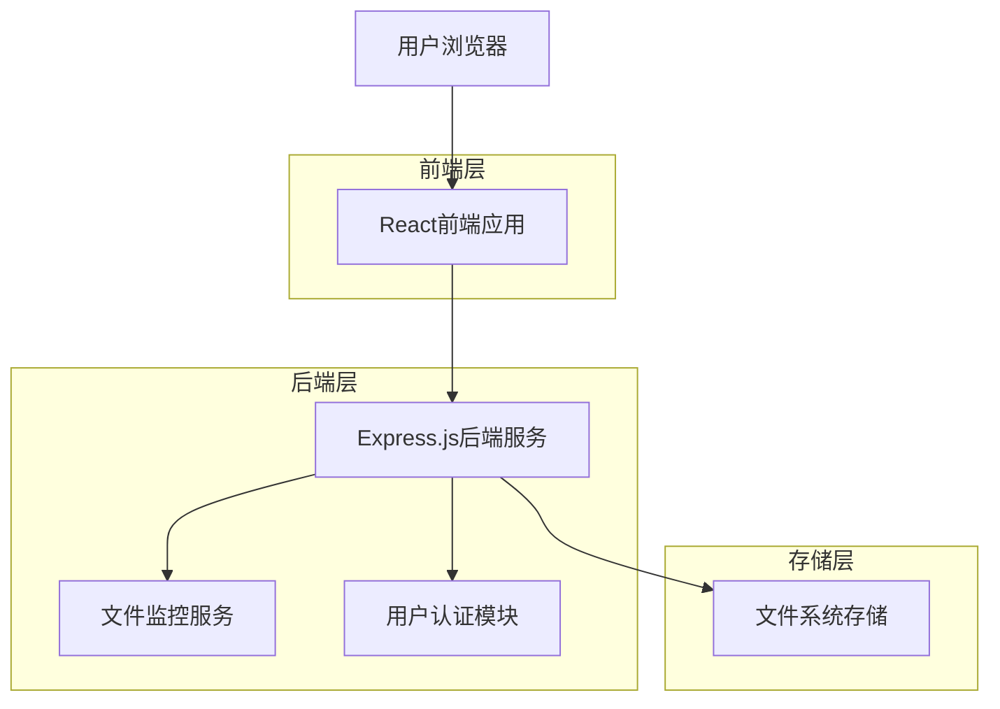
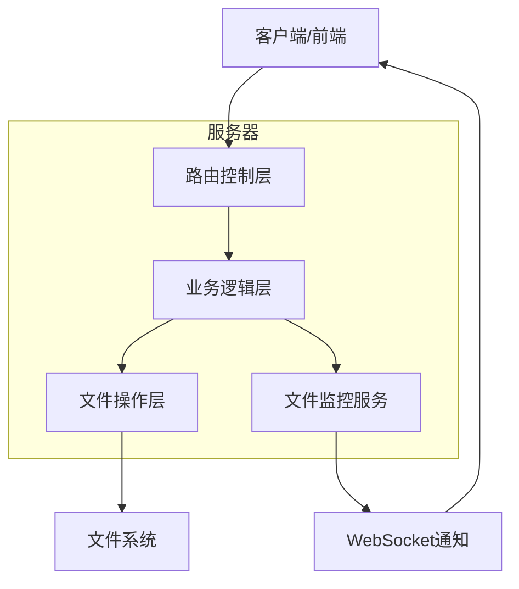

# 玉扶疏小说网站技术架构文档

## 1. 架构设计



## 2. 技术描述

- 前端：React\@18 + React Router\@6 + Axios + TailwindCSS\@3 + Vite

- 后端：Express.js\@4 + Multer + Chokidar + bcrypt + jsonwebtoken

- 存储：文件系统存储（JSON格式）

- 实时监控：Chokidar文件监控 + WebSocket

## 3. 路由定义

| 路由                               | 用途                                 |
| ---------------------------------- | ------------------------------------ |
| /                                  | 首页，展示推荐小说和最新更新         |
| /login                             | 登录页面，用户身份验证               |
| /register                          | 注册页面，新用户账户创建             |
| /profile                           | 用户个人页面，显示个人信息和作品管理 |
| /novel/:username/:bookname         | 小说详情页，显示小说信息和章节列表   |
| /read/:username/:bookname/:chapter | 小说阅读页，显示具体章节内容         |
| /publish                           | 小说发布页，创建和编辑小说           |
| /edit/:username/:bookname/:chapter | 章节编辑页，编辑具体章节             |

## 4. API定义

### 4.1 核心API

用户认证相关

```
POST /api/auth/register
```

请求参数：

| 参数名   | 参数类型 | 是否必需 | 描述     |
| -------- | -------- | -------- | -------- |
| username | string   | true     | 用户名   |
| email    | string   | true     | 邮箱地址 |
| password | string   | true     | 密码     |

响应参数：

| 参数名  | 参数类型 | 描述                  |
| ------- | -------- | --------------------- |
| success | boolean  | 注册是否成功          |
| message | string   | 响应消息              |
| token   | string   | JWT令牌（成功时返回） |

```
POST /api/auth/login
```

请求参数：

| 参数名   | 参数类型 | 是否必需 | 描述         |
| -------- | -------- | -------- | ------------ |
| username | string   | true     | 用户名或邮箱 |
| password | string   | true     | 密码         |

响应参数：

| 参数名  | 参数类型 | 描述         |
| ------- | -------- | ------------ |
| success | boolean  | 登录是否成功 |
| message | string   | 响应消息     |
| token   | string   | JWT令牌      |
| user    | object   | 用户信息     |

小说管理相关

```
GET /api/novels
```

响应参数：

| 参数名 | 参数类型 | 描述     |
| ------ | -------- | -------- |
| novels | array    | 小说列表 |
| total  | number   | 小说总数 |

```
POST /api/novels
```

请求参数：

| 参数名      | 参数类型 | 是否必需 | 描述     |
| ----------- | -------- | -------- | -------- |
| title       | string   | true     | 小说标题 |
| description | string   | true     | 小说简介 |
| category    | string   | true     | 小说分类 |
| cover       | file     | false    | 封面图片 |

```
GET /api/novels/:username/:bookname
```

响应参数：

| 参数名      | 参数类型 | 描述        |
| ----------- | -------- | ----------- |
| title       | string   | 小说标题    |
| description | string   | 小说简介    |
| author      | string   | 作者名      |
| chapters    | array    | 章节列表    |
| coverUrl    | string   | 封面图片URL |

```
GET /api/novels/:username/:bookname/:chapter
```

响应参数：

| 参数名        | 参数类型 | 描述     |
| ------------- | -------- | -------- |
| title         | string   | 章节标题 |
| content       | string   | 章节内容 |
| chapterNumber | number   | 章节序号 |
| publishTime   | string   | 发布时间 |

```
POST /api/novels/:username/:bookname/chapters
```

请求参数：

| 参数名        | 参数类型 | 是否必需 | 描述     |
| ------------- | -------- | -------- | -------- |
| title         | string   | true     | 章节标题 |
| content       | string   | true     | 章节内容 |
| chapterNumber | number   | true     | 章节序号 |

## 5. 服务器架构图



## 6. 数据模型

### 6.1 文件存储结构

```
项目根目录/
├── users/
│   └── [用户名]/
│       ├── profile.json          # 用户信息
│       └── articles/
│           └── [书名]/
│               ├── info.json     # 小说基本信息
│               ├── cover.png     # 封面图片
│               ├── chapter1.json # 第一章
│               ├── chapter2.json # 第二章
│               └── ...
```

### 6.2 数据定义语言

用户信息文件 (profile.json)

```json
{
  "username": "用户名",
  "email": "邮箱地址",
  "passwordHash": "加密后的密码",
  "registerTime": "2024-01-01T00:00:00.000Z",
  "avatar": "头像文件路径",
  "bio": "个人简介"
}
```

小说信息文件 (info.json)

```json
{
  "title": "小说标题",
  "description": "小说简介",
  "author": "作者用户名",
  "category": "小说分类",
  "createTime": "2024-01-01T00:00:00.000Z",
  "updateTime": "2024-01-01T00:00:00.000Z",
  "chapterCount": 10,
  "totalWords": 50000,
  "status": "连载中",
  "tags": ["标签1", "标签2"]
}
```

章节文件 (chapter\[N].json)

```json
{
  "chapterNumber": 1,
  "title": "章节标题",
  "content": "章节正文内容",
  "wordCount": 2000,
  "publishTime": "2024-01-01T00:00:00.000Z",
  "updateTime": "2024-01-01T00:00:00.000Z"
}
```

### 6.3 文件监控机制

使用Chokidar库监控users目录下的所有文件变化：

- 监控文件创建、修改、删除事件

- 通过WebSocket实时推送变化通知给前端

- 前端接收通知后自动刷新相关页面内容

- 支持批量更新和防抖处理，避免频繁刷新

监控配置：

```javascript
const chokidar = require('chokidar');
const watcher = chokidar.watch('./users', {
  ignored: /(^|[\/\\])\../, // 忽略隐藏文件
  persistent: true,
  ignoreInitial: true,
});
```
